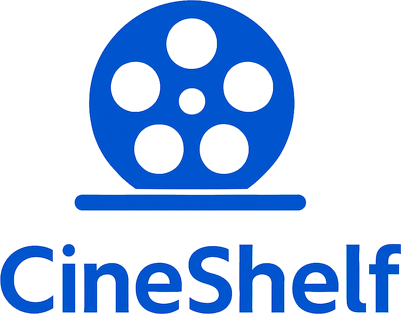
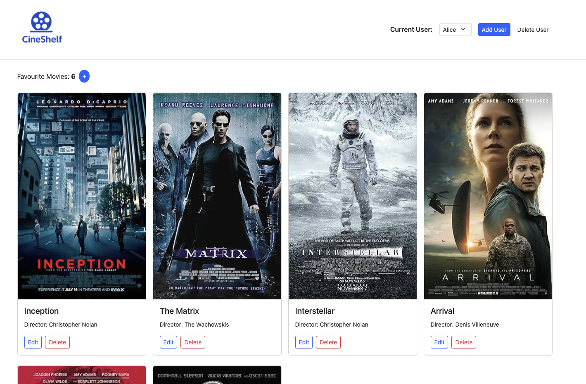
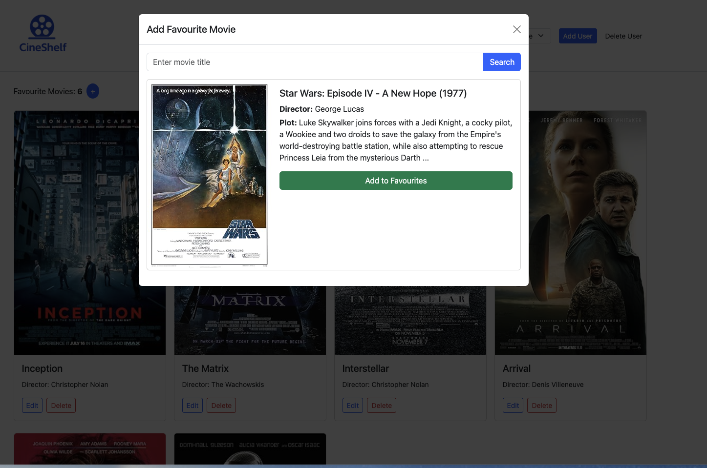

 
A Flask-based web application for managing personal movie collections. CineShelf lets you search OMDb for rich movie metadata, curate your favorites, track watch details, and enjoy a responsive Bootstrap-powered interface.

---

## ✨ Features

* 🎬 **Movie Management**

  * Search movies by title via OMDb API
  * View Poster, Year, Director, Genre, Plot
  * Add to your personal favorites shelf
  * Edit movie details (title, director, year)
  * Remove movies with confirmation prompts
  

* 👤 **User Profiles**

  * Create and delete multiple user accounts
  * Switch between users to see their individual shelves


* 📱 **Responsive UI**

  * Bootstrap 5 mobile-first design
  * Floating Action Button for quick “Add Movie”
  * Global modal dialogs for search, add, and edit flows
  

* 🔄 **API Integration & Data Handling**
 
  * Converts raw JSON into SQLAlchemy models
 

---

## 📸 Preview




---

## 🛠️ Tech Stack

* Python 3.11+
* Flask
* Flask-SQLAlchemy
* Flask-Limiter
* SQLite (default, configurable via `DATABASE_URL`)
* Requests
* python-dotenv
* Bootstrap 5

---

## 🧱 Project Structure

```text
CineShelf/
├── app/
│   ├── blueprints/
│   │   ├── home.py         # Main landing page & user selection
│   │   └── users.py        # User & movie management routes
│   ├── config.py           # Environment-specific configuration classes
│   ├── events.py           # SQLAlchemy event hooks (SQLite FK enforcement)
│   ├── extentions.py       # DB and rate limiter instances
│   ├── models.py           # SQLAlchemy ORM models: User & Movie
│   ├── services/
│   │   └── data_manager.py # Service layer for CRUD operations
│   ├── utils.py            # OMDb API integration & model builders
│   └── templates/
│       ├── base.html       # Base template
│       ├── index.html      # Home page template
│       ├── errors/         # Custom error page templates (403, 404, 500)
│       ├── fallback/       # Fallback templates for missing partials
│       └── partials/       # Reusable template fragments
├── data/                   # DB file and seed script location
│   └── data_seed.py        # Script to seed database with sample data
├── run.py                  # App entry point (application factory invocation)
├── requirements.txt        # Python dependencies
├── static/
│   ├── assets/             # Logo and preview images
│   ├── main.js             # Custom JavaScript utilities
│   └── style.css           # Custom styles
└── .env (not committed)    # Environment variables (secret keys, API keys)
```

---

## 🚀 Getting Started

### 1. Clone the Repository

```bash
git clone https://github.com/ItsHarfer/CineShelf.git
cd CineShelf
```

### 2. Set Up Environment Variables
Obtaining an OMDb API Key

Visit OMDb API Key Page.

Select the Free Trial option and register with your email.

You will receive your API key via email.

Copy the key and replace your-omdb-api-key in your .env file:


Create a `.env` file in project root:

```env
FLASK_CONFIG=development
SECRET_KEY=your-secret-key
DATABASE_URL=sqlite:///data/movies.sqlite
OMDB_API_KEY=your-omdb-api-key
FLASK_RUN_HOST=127.0.0.1   # optional
FLASK_RUN_PORT=5000        # optional
```

### 3. Install Dependencies

```bash
python3 -m venv venv
source venv/bin/activate
pip install -r requirements.txt
```

### 4. Seed the Database (Optional)

```bash
python data/data_seed.py
```

### 5. Run the App

```bash
python run.py
```

Open your browser at `http://127.0.0.1:5000`.

---

## 👤 Author

Martin Haferanke
GitHub: [@ItsHarfer](https://github.com/ItsHarfer)
Email: [martin.haferanke@gmail.com](mailto:martin.haferanke@gmail.com)

---

## 📄 License

Licensed under the MIT License.
This project is intended for personal movie collection management and demonstration purposes.
